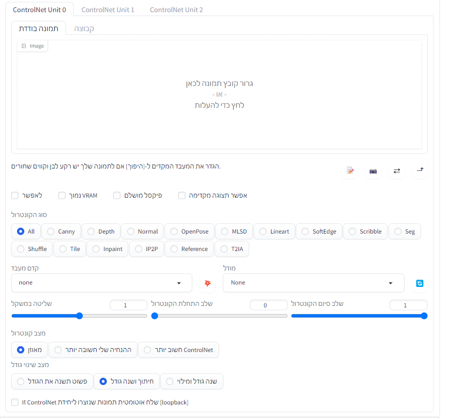

# controlnet-Hebrew
The controlnet project is now translated into Hebrew

## הוראות התקנה
  ## התקנה ידנית
1. את הקובץ  `controlnet_ui_group.py` עליך לשים בנתיב `stable-diffusion-webui\extensions\sd-webui-controlnet\scripts\controlnet_ui\controlnet_ui_group.py`
2. את הקובץ  `external_code.py` עליך לשים בנתיב `stable-diffusion-webui\extensions\sd-webui-controlnet\internal_controlnet\external_code.py`
3.  את הקובץ  `processor.py` עליך לשים בנתיב `stable-diffusion-webui\extensions\sd-webui-controlnet\scripts\processor.py`
- עליך להחליף את כל הקבצים המקוריים בקבצים שתוריד מפה
  ## התקנה אוטומטית
  הוספתי סקריפט שמתקין את הכל אוטומטית
  1. הורד אותו מהשיחרור
  2. שים אותו בתקית השורש של AUTOMATIC1111 בד"כ זה נקרא `stable-diffusion-webui`
  3. הפעל את הסקריפט אם זה יותקן בהצלחה יופיע לך הודעה שזה הותקן אם הופיע הודעה שזה נכשל כניראה זה לא בתקיית השורש של AUTOMATIC1111 חפש את התקייה ונסה שוב 
